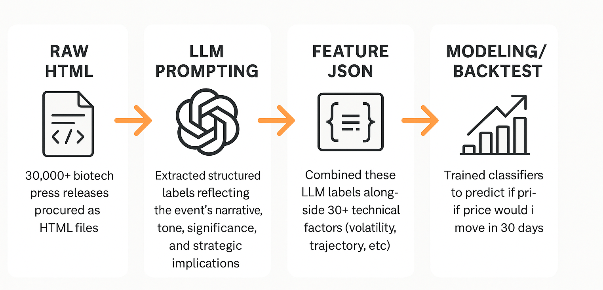
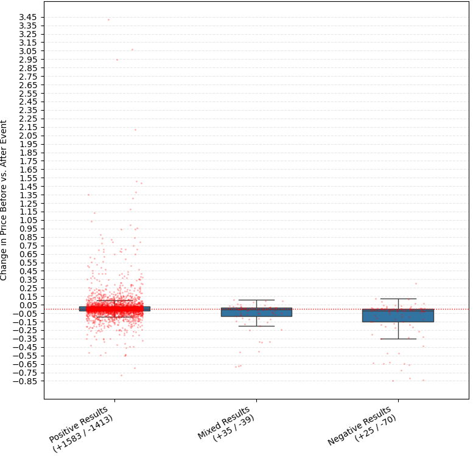
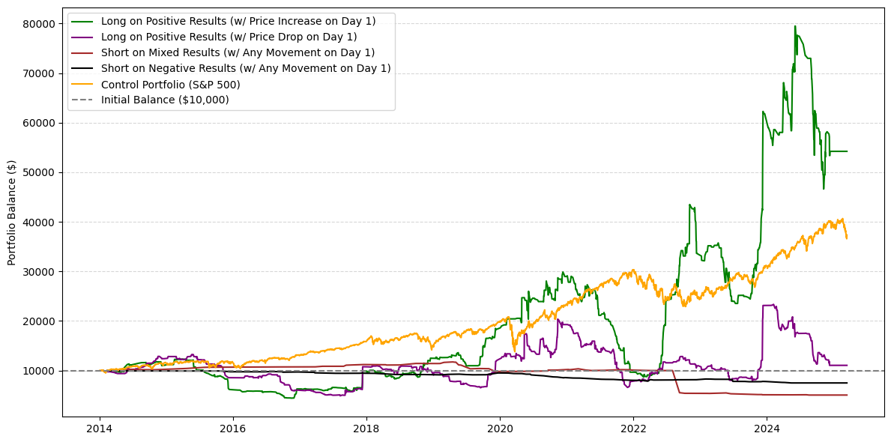

  

## Introduction

After years working in biotech, I became increasingly curious about how markets respond to clinical trial results and FDA decisions. Surprisingly, **positive trial outcomes sometimes triggered stock price drops**, while **negative results occasionally caused gains**. This counterintuitive behavior inspired me to dig deeper: *Are there hidden patterns in how the market reacts to biotech press releases?*

Thanks to recent advances in **large language models (LLMs)**, it's now possible to extract nuanced insights from unstructured text at scale. This project uses LLMs to automate the parsing and annotation of ~30,000 biotech press releases from 2014–2025.

Each release was processed using a library of tailored prompts that extracted structured features such as:

- **Publication metadata** (date, time, timezone, title)
- **Clinical trial outcomes** (efficacy, survival rates, adverse events)
- **Narrative tone and sentiment** (e.g., bullishness, hedging, promotional language)
- **Strategic or commercial signals** (pipeline prioritization, commercial readiness, M&A potential)
- **Audience targeting and credibility cues** (investor focus, third-party validation, media presence)
- **Trial design rigor** and **regulatory framing**

These annotations were not just for descriptive analysis. I also used them to train **Random Forest classifiers** to predict post-event price movement. Specifically, I explored whether these qualitative features—along with technical indicators like recent volatility and price momentum—could help forecast:

1. **Whether a stock would significantly move in the 30 days following a press release**, and  
2. **In which direction that movement would occur**.

For example: *If a stock dropped -5% on day one after a "Positive" press release, could we predict whether it would recover?*  
By blending natural language insights with price history, the goal was to model event-driven trading opportunities in biotech using LLM-informed signals.

## Data Overview

This project analyzes **~30,000 press releases** from **~100 biotech and pharmaceutical companies** between **2014–2025**. 

- Press releases were collected manually from company websites as raw HTML files and parsed using scripts in `data/data_processing_scripts/`.
- Associated stock price data was sourced using the `yfinance` API.
- LLMs were used to extract structured features like date, title, and press release type.

Processed CSVs include subsets such as **positive clinical trial outcomes**, **negative outcomes**, and other categories of interest. The full dataset (~3GB) isn’t included in this repo due to GitHub file size limits, but you can download it from [Google Drive](https://drive.google.com/file/d/1l1WDZ7gIsvG6SqwvTA5B7s_OA4XrfE5R/view?usp=dr).

> ⚠️ **Note**: This dataset excludes companies that were acquired, merged, or went bankrupt — so extreme outcomes (like buyouts or collapses) are underrepresented.

## Methods

This project combines natural language processing and quantitative modeling to explore the market impact of biotech press releases. The workflow is as follows:

1. **LLM Prompting and Feature Extraction**  
   Using carefully designed prompts, large language models were employed to extract structured insights from each press release. This included:
   - Clinical outcome and tone
   - Strategic indicators (e.g., pipeline reprioritization, M&A hints)
   - Commercial readiness and regulatory framing
   - Audience targeting and credibility cues
   - Trial design features and real-world impact

   A total of 8 prompt templates were used to capture different angles of analysis.

2. **Feature Integration**  
   The extracted labels were compiled into structured JSON objects and merged with historical stock price features (e.g., volatility, trajectory, day-1 reaction).

3. **Modeling and Backtesting**  
   Using the combined dataset, classifiers (Random Forests) were trained to predict:
   - Whether a stock would move significantly in the 30 days following a press release
   - The **direction** of the movement (positive or negative)
   
   These models were then tested using simulated event-based backtests to evaluate performance in realistic trading scenarios.

## Results

### 📰 Press Release Categories and Volatility

Press releases were grouped into 9 major categories such as:

- Clinical Trial / Regulatory Updates
- Stock Offerings / Index Inclusions
- Partnerships / Collaborations
- Executive Changes
- Legal Disputes

### Volatility by Press Release Type

To understand which types of announcements drive the biggest market reactions, I calculated the **1-day stock price change** following each press release. The change is measured relative to the average of the **two days before the event**, which helps account for announcements released outside of trading hours.

Among all press release types:

- **Stock Offering / Index Inclusion** and **Clinical Trial / Regulatory Updates** exhibited the **highest volatility**, with large swings in both directions.
- **Partnerships and Licensing Agreements** also showed significant movement, suggesting investors pay close attention to these strategic events.
- In contrast, more routine updates such as **executive changes**, **financials**, **conferences**, and **legal disputes** produced more muted market responses.

📋 *Sample Summary (sorted by volatility):*

| Type                                              | Std Dev | Mean    | Median  | Min     | Max     | Count |
|---------------------------------------------------|---------|---------|---------|---------|---------|--------|
| Stock Offerings / Index Inclusion                 | 0.163   | 1.75%   | -0.14%  | -67.3%  | +306.6% | 2402   |
| Clinical Trial / Regulatory Update                | 0.148   | 0.68%   | -0.03%  | -84.9%  | +342.4% | 7247   |
| Partnership / Collaboration / Licensing Agreement | 0.131   | 1.77%   | 0.30%   | -61.7%  | +192.9% | 1306   |
| Financial Update (Quarterly or Annual)            | 0.103   | 0.30%   | -0.18%  | -71.6%  | +263.3% | 4276   |
| Executive / Board Changes                         | 0.073   | -0.14%  | -0.58%  | -31.0%  | +84.8%  | 1196   |
| Other                                             | 0.072   | 0.66%   | 0.06%   | -68.2%  | +97.9%  | 3017   |
| Company Conference Participation                  | 0.070   | 0.56%   | 0.17%   | -65.6%  | +117.1% | 4777   |
| Legal Dispute                                     | 0.062   | 1.80%   | 0.71%   | -6.5%   | +31.5%  | 90     |

### Market Reactions to Clinical Trial Outcomes

We used LLMs to categorize trial-related press releases as:

- **Positive**
- **Negative**
- **Mixed**
- **Null**

Surprisingly, nearly half of the positive outcomes triggered negative price reactions—a counterintuitive pattern that originally sparked my curiosity and inspired this project. 

| Result | Mean Return | Positive Count | Negative Count | Pos/Neg Ratio |
|--------|-------------|----------------|----------------|-------|
| Positive | +1.6% | 1583 | 1413 | 1.12 |
| Mixed    | -7.8% | 35   | 39   | 0.89 |
| Negative | -12.0% | 25   | 70   | 0.36 |

*Figure 1 — Price change distribution by result type:*

### Deeper Insights: What Drives Market Reactions to Positive Trial Results?

While the previous section showed that **positive clinical trial results** often lead to surprisingly mixed stock price reactions, this raises a key question: *What factors influence whether the market reacts positively or negatively to seemingly good news?* To explore this, I analyzed a range of contextual features—such as market cap, timing of the announcement, regulatory involvement, trial characteristics, and therapeutic focus—to see if any patterns emerged that might help explain these divergent outcomes.

The following table summarizes the **mean return**, **sample size**, and **positive-to-negative ratio** of press releases explicitly labeled as “Positive Results,” broken down by category.

Several noteworthy patterns emerged:

- **Market Cap Matters**  
  Mid- and large-cap companies had higher positive-to-negative ratios (1.33 and 1.25, respectively), suggesting that **investors are more likely to reward positive results from larger, more established firms**. In contrast, small caps often saw negative responses, with a ratio below 1.0.

- **Timing is Telling**  
  Press releases that pointed to **future milestones** or results (e.g., upcoming presentations or planned regulatory submissions) were more likely to generate positive sentiment than those reporting current outcomes. This may reflect the market's tendency to price in **forward-looking optimism**.

- **Regulatory Context**  
  News tied to **Emergency Use Authorizations (EUA)** and **Supplemental NDAs** generated the strongest positive bias, with ratios of 1.50 and 1.36 respectively. Meanwhile, other categories like **Regulatory Opinions** or **Label Expansions** showed much more mixed reactions.

- **Trial Design Nuances**  
  Trials involving **combination therapies** slightly outperformed monotherapies in terms of market optimism. Higher trial phases (like **Phase 3**) also correlated with better returns, likely due to the perceived de-risking of results.

- **Partnership Signals**  
  Announcements involving a **partnership or co-sponsor** actually received **slightly more favorable market responses** than independent ones. This may reflect investor confidence in external validation, shared development risk, or the credibility added by collaboration with larger or more experienced partners.

- **Therapeutic Area Sensitivity**  
  Diseases affecting the **nervous system**, **respiratory system**, and **skin** were associated with stronger market reactions than areas like **urogenital** or **infectious diseases**, which actually trended negatively—even after “positive” trial outcomes.

- **Drug Modality Differences**  
  While **small molecules**, **biologics**, and **gene therapies** tended to have favorable market reactions, others like **vaccines**, **peptides**, and **oligonucleotides** were more mixed—suggesting that the market may still be cautious about less-established or more experimental modalities.

Together, these results highlight that a "positive" clinical trial result isn't always enough on its own to move a stock higher. The **context**—who's announcing, what the disease is, how the trial was structured, and what regulatory pathway is involved—plays a crucial role in shaping investor sentiment.

### Summary of Event Impact by Category

| Category                  | Subgroup / Type                         | Mean Return | Count | Pos/Neg Ratio |
|---------------------------|------------------------------------------|-------------|--------|----------------|
| **Market Cap**            | Small Cap                                | 0.013       | 923    | 0.857          |
|                           | Mid Cap                                  | 0.048       | 561    | 1.328          |
|                           | Large Cap                                | 0.008       | 1504   | 1.248          |
| **Timing**                | Future-Looking Release                   | 0.019       | 155    | 1.153          |
|                           | Present-Focused Release                  | 0.017       | 2839   | 1.122          |
| **Regulatory Body**       | FDA                                      | 0.027       | 1242   | 1.206          |
|                           | EMA                                      | -0.008      | 65     | 0.857          |
|                           | Other                                    | 0.030       | 29     | 0.813          |
| **Regulatory Action Type**| Emergency Use Authorization (EUA)        | 0.007       | 25     | 1.500          |
|                           | Supplemental NDA (sNDA)                  | 0.015       | 78     | 1.364          |
|                           | Fast Track / Orphan / Priority           | 0.010       | 94     | 1.238          |
|                           | New Drug Application (NDA)               | 0.055       | 331    | 1.135          |
|                           | Label Expansion                          | -0.006      | 41     | 1.050          |
|                           | IND Application                          | 0.015       | 24     | 1.000          |
|                           | Biologics License App (BLA)              | 0.009       | 22     | 1.000          |
|                           | Regulatory Opinion Only                  | 0.021       | 93     | 0.938          |
| **Trial Type**            | Combination Therapy                      | 0.015       | 810    | 1.189          |
|                           | Monotherapy                              | 0.018       | 2175   | 1.101          |
| **Trial Phase**           | Phase 3                                  | 0.019       | 1417   | 1.167          |
|                           | Phase 2                                  | 0.011       | 909    | 1.134          |
|                           | Phase 1                                  | 0.007       | 528    | 0.899          |
| **Partnership Type**      | Partnership                              | 0.005       | 1101   | 1.211          |
|                           | Independent                              | 0.023       | 1797   | 1.087          |
| **Therapeutic Area**      | Nervous System Diseases                  | 0.030       | 449    | 1.339          |
|                           | Respiratory Tract Diseases               | 0.030       | 133    | 1.293          |
|                           | Skin Diseases                            | 0.017       | 192    | 1.286          |
|                           | Hematology                               | 0.014       | 575    | 1.203          |
|                           | Inflammation & Immunology                | 0.021       | 448    | 1.175          |
|                           | Oncology                                 | 0.008       | 1047   | 1.128          |
|                           | Rare Genetic Diseases                    | 0.021       | 498    | 1.119          |
|                           | Cardiovascular & Metabolic Diseases      | 0.026       | 426    | 1.029          |
|                           | Infectious Diseases                      | 0.023       | 295    | 0.855          |
|                           | Urogenital Diseases                      | -0.006      | 34     | 0.619          |
| **Drug Modality**         | Small Molecule                           | 0.018       | 1348   | 1.150          |
|                           | Gene Therapy                             | 0.005       | 226    | 1.194          |
|                           | Biologic                                 | 0.016       | 1423   | 1.146          |
|                           | Oligonucleotide                          | 0.005       | 115    | 0.983          |
|                           | Peptide                                  | 0.034       | 90     | 0.957          |
|                           | Vaccine                                  | 0.018       | 119    | 0.919          |

Market capitalization was classified using a simple rule-based function: companies with a market cap under $2B were labeled **Small Cap**, those between $2B and $10B as **Mid Cap**, and those above $10B as **Large Cap**.

### Feature Importance Analysis: What Drives Immediate Price Reaction for Positive Results?

To better understand what factors influence the **1-day price reaction** following a “Positive Results” press release, I trained a logistic regression model using **recursive feature elimination (RFE)** and cross-validated it over 10 folds. The model aimed to predict whether a stock would move up or down the day after positive results were announced, based on structured features extracted by LLMs.

While the model achieved modest predictive performance (54% accuracy, with stronger recall on upward movements), the primary goal here was interpretability: identifying which features consistently contributed to short-term positive price reactions.

Across 10 cross-validation folds, the following features emerged as the **most consistently important**:

- `combination_or_monotherapy_combo`  
- `combination_or_monotherapy_mono`  
- `how_data_is_shared_Paper Publication, Conference Presentation`  
- `regulatory_action_type_Supplemental Biologics License Application (sBLA)`  
- `market_cap_label_Small Cap`  
- `regulatory_action_type_Rolling Biologics License Application (BLA) Submission)`  
- `regulatory_action_type_Supplemental New Drug Application (sBLA)`  
- `regulatory_body_Health Canada`  
- `regulatory_action_type_Supplemental New Drug Application (sNDA)`  
- `regulatory_action_type_Marketing Authorization Application (MAA)`

These patterns suggest that **trial structure (e.g., monotherapy vs. combo)**, **how results are shared (e.g., conference vs. PR)**, and **regulatory context** (type of filing, country) all meaningfully influence short-term investor behavior when the underlying outcome is labeled “positive.”

## Heuristic Strategy Testing

We explored whether basic trading rules could exploit these patterns. For example:

> “Do positive results with a Day 1 price drop of >5% tend to bounce back in the next 30 days?”

We simulated a few of these strategies and compared them against an S&P 500 benchmark.

 *Figure 2 — Strategy performance over time:*

## ML-Based Strategy Performance on Clinical Trial Results

To explore whether market reactions could be anticipated using structured features, I built a two-step modeling pipeline:

1. **Outlier Prediction** – First, a classifier predicts whether a press release will trigger a large 30-day price move (≥10%).
2. **Direction Prediction** – If flagged as an outlier, a second model forecasts whether the move will be **positive** or **negative**.

Accordingly, the outputs of these models were treated as a tradeable signal:

- **+1** → Buy and hold for 30 days  
- **–1** → Short and hold for 30 days  
- **0** → No trade

This approach was tested separately on **positive** and **negative** trial result announcements:

#### Positive Clinical Trial Results

For “Positive” clinical trial outcomes, the model generated **368 trade signals**. However, the strategy underperformed the market:

- **Average Strategy Return**: –1.49%  
- **Average S&P 500 Return (same periods)**: +2.10%  
- **Alpha**: –3.59%  
- **Win Rate vs. SPY**: 45.4%

Despite identifying some real movements, the model failed to consistently translate positive sentiment into profitable trades.

#### Negative Clinical Trial Results

For “Negative” announcements, the model generated far fewer trades — just **5 short signals** — but the results were compelling:

- **Average Strategy Return**: +18.74%  
- **Average S&P 500 Return (same periods)**: +1.02%  
- **Alpha**: +17.72%  
- **Win Rate vs. SPY**: 100.0%

In this case, the model successfully identified a handful of negative press releases that preceded continued declines — offering short opportunities with strong follow-through. That said, the low number of trades suggests this result should be viewed as preliminary rather than conclusive.

## Future Directions

I'm no longer actively working on this project, but here are ideas if you want to build on it:

- **RSS Integration:** Automate live press release tracking from company IR feeds
- **Explore Other Release Types:** Partnerships & offerings had high volatility too
- **Apply Beyond Biotech:** Framework could be adapted for sectors like medtech, fintech, etc.

---
> ⚠️ **Disclaimer**  
> The information provided in this article is for educational and informational purposes only and should not be construed as financial or investment advice. The author and the publisher are not financial advisors or professionals and do not claim to be providing personalized financial advice.  
> 
> The content reflects the author's own research, analysis, and opinions, which are solely their own and do not represent or reflect the views of any current or former employer.  
> 
> The results discussed may not be applicable to individual circumstances. Before making any financial decisions or investments, readers should consult with a qualified financial advisor to consider their specific situation, goals, and risk tolerance.  
> 
> Past performance is not indicative of future results, and no representation or warranty is made regarding the accuracy or completeness of the information provided.
